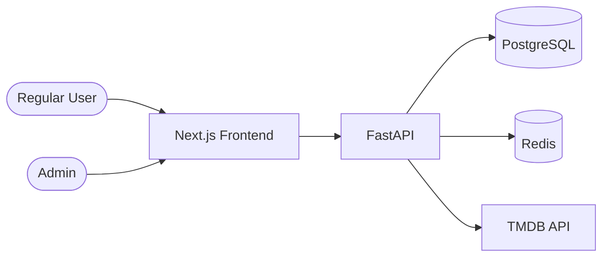
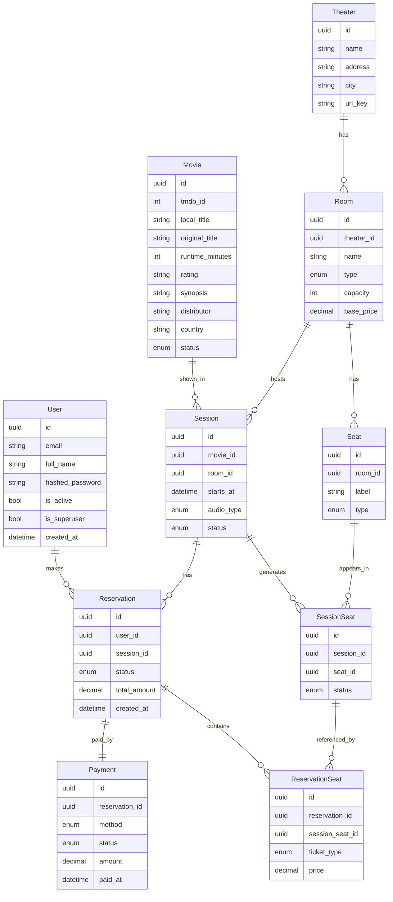
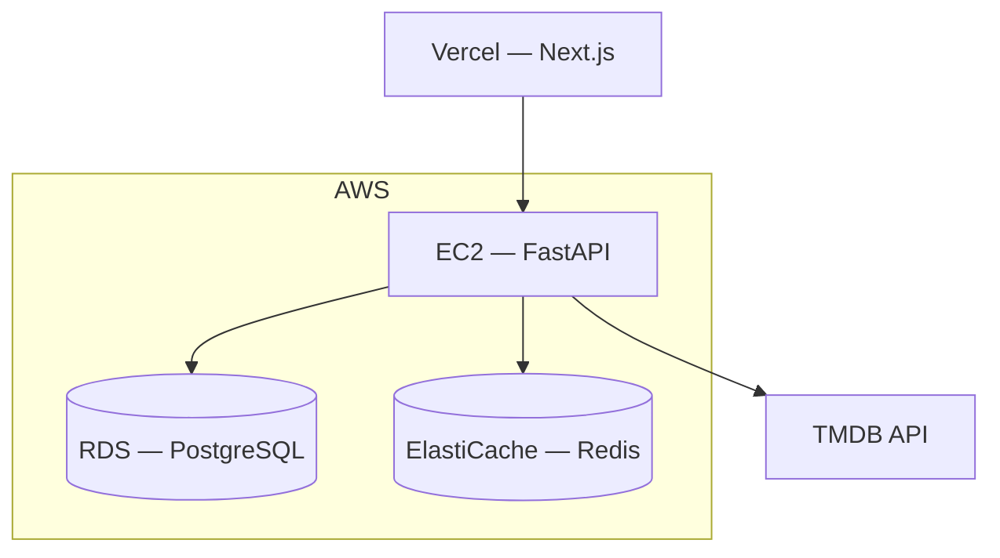

This document describes the full architecture of the **Ticket Cine** project — a fullstack study project for web development using FastAPI (backend) and Next.js (frontend).

> 💡 This is a **study project**. The architecture is intentionally straightforward — no over-engineering. The goal is to learn by building something real.
> 

---

# Stack

| Layer | Technology |
| --- | --- |
| Backend | FastAPI (Python) |
| Frontend | Next.js (React + TypeScript) |
| Database | PostgreSQL |
| Seat Lock | Redis |
| ORM | SQLModel + Alembic |
| Auth | JWT — PyJWT + pwdlib (Argon2 + bcrypt) |
| Task Scheduler | APScheduler |
| HTTP Client | httpx (async) |
| Package Manager | uv |
| Server | FastAPI CLI (uvicorn) |
| External API | TMDB API |
| Deployment | AWS (planned) |

---

# System Overview

The system has two deployable units: a **FastAPI REST API** and a **Next.js frontend**. They communicate via HTTP. The backend owns all business logic, persistence and seat locking. The frontend is responsible for rendering and user interaction.



---

# Data Model

## Entities and Relationships



## Entity Notes

### SessionSeat

This is the central entity for seat availability. When a `Session` is created, the system automatically generates one `SessionSeat` record for every `Seat` in the `Room`, all starting with `status = available`.

| status | Meaning |
| --- | --- |
| `available` | Seat is free to select |
| `locked` | Seat is held by a user (Redis TTL active) |
| `reserved` | Seat is permanently taken (payment confirmed) |

> The `locked` status in PostgreSQL is kept in sync with the Redis key. If the Redis key expires, a background job resets the status back to `available`.
> 

### Seat vs SessionSeat

- `Seat` = the **physical** seat in the room. It never changes.
- `SessionSeat` = the **state** of that seat in a specific session. It changes during the booking flow.

This separation ensures the same physical seat A5 can be `reserved` in the 14:00 session and `available` in the 18:00 session simultaneously.

### Session fields

| field | values |
| --- | --- |
| `audio_type` | `dubbed`, `subtitled` |
| `status` | `scheduled`, `ongoing`, `finished`, `cancelled` |

### Movie fields

| field | values |
| --- | --- |
| `status` | `upcoming`, `pre_sale`, `in_theaters`, `out_of_theaters` |

---

# Backend Architecture (FastAPI)

## Project Structure

Follows the [fastapi/full-stack-fastapi-template](https://github.com/fastapi/full-stack-fastapi-template) structure. All SQLModel models are centralised in a single `app/models.py` — this is required to avoid circular imports with SQLModel relationships.

```
backend/
├── pyproject.toml           → dependencies managed by uv
├── uv.lock                  → locked dependency versions (commit this)
├── .env                     → environment variables (do not commit)
├── .env.example             → template for .env (commit this)
│
├── app/
│   ├── main.py              → app entrypoint, lifespan, router registration
│   ├── models.py            → ALL SQLModel models in a single file
│   ├── crud.py              → database operations organised by domain
│   │
│   ├── api/
│   │   ├── deps.py          → SessionDep, get_current_user, require_admin
│   │   └── routes/
│   │       ├── auth.py      → POST /auth/login, POST /auth/register
│   │       ├── users.py     → GET /users/me
│   │       ├── movies.py    → GET /movies, GET /movies/{id}, admin routes
│   │       ├── theaters.py  → CRUD /theaters, /theaters/{id}/rooms
│   │       ├── sessions.py  → GET /sessions, POST /sessions (admin)
│   │       └── reservations.py
│   │
│   └── core/
│       ├── config.py        → Settings via pydantic-settings (SQLALCHEMY_DATABASE_URI computed field)
│       ├── db.py            → engine + init_db (creates first superuser on startup)
│       ├── security.py      → JWT creation/validation, password hashing
│       └── seat_lock.py     → Redis seat locking logic
│
└── alembic/                 → database migrations
    ├── env.py
    └── versions/
```

## Authentication

JWT is used with two roles: `admin` and `user`. The token is returned on login and must be sent as a `Bearer` token in the `Authorization` header on protected routes.

**Libraries (matches fastapi/full-stack-fastapi-template):**
- JWT: `PyJWT` (`pyjwt`) with HS256 algorithm
- Password hashing: `pwdlib` with Argon2 as primary hasher and bcrypt as legacy fallback

JWT payload:

```json
{
  "sub": "user-uuid",
  "exp": 1234567890
}
```

Route protection is done via FastAPI dependencies defined in `api/deps.py`:

```python
# requires valid JWT
@router.get("/me")
def get_me(current_user: User = Depends(get_current_user)):
    ...

# requires admin role
@router.post("/sessions")
def create_session(current_user: User = Depends(require_admin)):
    ...
```

The `SessionDep` annotated type is used for DB session injection in all routes:

```python
# api/deps.py
SessionDep = Annotated[Session, Depends(get_db)]

# usage in any route
@router.get("/movies")
def list_movies(session: SessionDep) -> list[MoviePublic]:
    ...
```

## Seat Locking with Redis

Redis is used to implement a temporary, expiring hold on seats during checkout. It uses atomic `SET NX EX` to avoid race conditions when two users try to lock the same seat simultaneously.

### Lock key format

```
seat-lock:{sessionId}:{seatId}
```

### Value stored

```
{userId}
```

### TTL

```
300 seconds (5 minutes)
```

### SessionSeat State Machine

> 📌 **Insert the state machine diagram image here** (seat_lock_state_machine.png)
> 

Each `SessionSeat` record transitions through the following states:

| State | Meaning |
| --- | --- |
| `available` | Seat is free — any user can select it |
| `locked` | Seat is held by a user for up to 5 minutes (Redis TTL active) |
| `reserved` | Seat is permanently taken — payment was confirmed |

**Transitions:**

- `available → locked`: User selects seats and calls `POST /reservations/lock`. The API runs `SET NX EX 300` atomically on Redis for each seat. On success, PostgreSQL is updated to `locked`.
- `locked → reserved`: User confirms payment via `POST /reservations/confirm`. The API updates PostgreSQL to `reserved` and deletes the Redis key.
- `locked → available` (TTL expired): Redis key expires naturally after 5 minutes. A cron job detects orphaned `locked` records and resets them to `available`.
- `locked → available` (user clicked Back): User navigates back during checkout. The API explicitly releases the Redis keys and resets the records to `available`.

### Conflict flow — seat already locked by another user

This is a race condition that happens when two users have the seat map open at the same time. User A's frontend shows seat A5 as available, but User B locks it before User A clicks "Next".

**Step by step:**

1. User A selects seats (e.g. A5, A6) and clicks "Next".
2. The frontend calls `POST /reservations/lock` with `{ sessionId, seatIds: ["A5", "A6"] }`.
3. The API iterates over the requested seats and attempts `SET NX EX 300` in Redis for each one atomically.
4. For seat A5, Redis returns `nil` — the key already exists (User B holds it).
5. **Atomicity**: the API immediately releases any locks it already acquired in this same request (e.g. A6) before responding. This prevents orphaned partial locks.
6. The API responds with **409 Conflict**, including the list of seats that could not be locked:

```json
{
  "status_code": 409,
  "message": "One or more seats are no longer available",
  "conflicting_seats": ["A5"]
}
```

1. The frontend displays a warning to the user identifying which seats are unavailable.
2. The frontend calls `GET /sessions/{id}/seats` to re-fetch the current state of all seats in the session.
3. The seat map is updated — conflicting seats are now shown as `locked` (or `reserved` if payment completed in the meantime).
4. The user selects different available seats and retries.

> The conflict flow is why the frontend must never assume the seat map is up to date after a failed lock attempt. A re-fetch is always required before the user can retry.
> 

### TTL Expiry Handling

An APScheduler job configured in `app/core/seat_lock.py` runs every minute and queries `SessionSeat` records with `status = locked` where the corresponding Redis key no longer exists. Those records are reset to `available`.

This ensures PostgreSQL stays consistent with Redis even when users abandon checkout without clicking "Back" — for example by closing the browser tab or letting the timer run out.

## TMDB Integration

The `app/api/routes/movies.py` module wraps the TMDB API using `httpx` (async HTTP client) and is only called by admins when adding movies. The flow is:

1. Admin searches a movie title → `GET /movies/tmdb/search?q=...` → returns TMDB results
2. Admin selects a movie → `POST /movies/tmdb/import/{tmdb_id}` → saves to local DB
3. From that point, the local `Movie` record is the source of truth

Images are stored by URL reference from TMDB initially. A local storage solution (S3) can be added later.

---

# Frontend Architecture (Next.js)

## Route Structure

The app uses the **App Router** (Next.js 13+). Routes are grouped by access level.

```
app/
├── (public)/                     → no auth required
│   ├── page.tsx                  → homepage
│   ├── movies/
│   │   └── [id]/
│   │       └── page.tsx          → movie detail + available sessions
│   └── sessions/
│       └── [id]/
│           └── page.tsx          → seat map (read-only if not logged in)
│
├── (checkout)/                   → requires auth (middleware redirect)
│   └── checkout/
│       └── [sessionId]/
│           ├── seats/page.tsx    → interactive seat selection
│           ├── tickets/page.tsx  → ticket type selection
│           └── payment/page.tsx  → payment confirmation
│
├── (user)/                       → requires auth
│   └── orders/
│       └── page.tsx              → my reservations
│
├── (admin)/                      → requires admin role
│   ├── movies/page.tsx
│   ├── movies/new/page.tsx
│   ├── theaters/page.tsx
│   ├── sessions/page.tsx
│   └── sessions/new/page.tsx
│
└── (auth)/
    ├── login/page.tsx
    └── register/page.tsx
```

## Authentication on the Client

JWT is stored in an **httpOnly cookie** set by the Next.js server on login. This prevents XSS access to the token from client-side JavaScript.

Next.js `middleware.ts` intercepts protected routes and redirects unauthenticated users to `/login`.

## API Layer

All HTTP calls to the FastAPI backend are centralized in `lib/api/`. Each domain has its own file:

```
lib/
└── api/
    ├── client.ts          → base fetch wrapper with auth header
    ├── movies.ts          → getMovies(), getMovieById()
    ├── sessions.ts        → getSessionsByMovie(), getSessionSeats()
    ├── reservations.ts    → lockSeats(), confirmReservation()
    └── auth.ts            → login(), register(), logout()
```

Server Components call the API directly (no client-side fetch). Client Components use the same `lib/api/` functions but run in the browser.

## State Management

No global state library (no Redux, no Zustand) for the initial phase. The checkout flow uses React `useState` and passes state through the URL (via `searchParams`) between steps.

| Data | Where it lives |
| --- | --- |
| Auth state (user info) | Next.js middleware + cookie |
| Selected seats | URL params + local state |
| Seat map availability | Server Component fetch on page load |
| Countdown timer (5 min) | Client Component `useState`  • `useEffect` |

## Seat Map Component

This is the most complex UI component. It renders the room's seats as a grid and handles selection.

```
components/
└── seat-map/
    ├── SeatMap.tsx        → main grid component
    ├── SeatButton.tsx     → individual seat (available / locked / reserved / selected)
    └── SeatLegend.tsx     → color legend
```

Availability data is fetched server-side on page load. After seat selection and lock, a 5-minute countdown is displayed. If the timer reaches zero, the user is redirected back to seat selection with a warning.

---

# Deployment (Planned — AWS)

No deployment decisions are final. The target infrastructure for study is AWS.

| Component | Planned service |
| --- | --- |
| FastAPI Backend | EC2 or Elastic Beanstalk |
| Next.js Frontend | Vercel (simplest) or EC2 |
| PostgreSQL | RDS (PostgreSQL) |
| Redis | ElastiCache |
| Environment config | AWS Secrets Manager or .env |
| Static assets / images | S3 (future phase) |



---

# Open Decisions

| Topic | Status | Notes |
| --- | --- | --- |
| ORM | ✅ SQLModel + Alembic | Built on SQLAlchemy + Pydantic — single class for DB and API validation |
| Template | ✅ full-stack-fastapi-template | Official FastAPI template, all models in single [models.py](http://models.py) |
| Package manager | ✅ uv | Replaces pip + venv, uses pyproject.toml + uv.lock |
| Hosting (backend) | ⏳ Pending | EC2 vs Elastic Beanstalk |
| Hosting (frontend) | ⏳ Pending | Vercel preferred for simplicity |
| Image storage | ⏳ Future | S3 when needed |
| Payment gateway | ⏳ Simulated | No real gateway for study phase |
| Email notifications | ⏳ Future | Not in scope for initial phase |